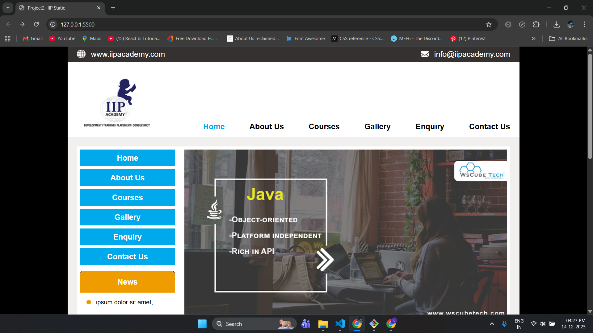

wscube2025-project2-IIP_static_website

📌 Project Overview
This project is a static website for IIP (Internship & Industrial Program) developed as part of WsCube Tech 2025 – Project 2.
The website is designed using HTML, CSS, and basic JavaScript, focusing on structured layouts, multi-page navigation, and traditional styling techniques.

The project represents a real-world institutional website layout with multiple pages such as About, Courses, Gallery, Enquiry, and Contact.

�📷 Preview
## Preview

🌐 Website Structure & Pages

The project consists of a multi-page static website, including:

Home Page – Overview of IIP, courses, and work process

About Us Page – Information about IIP and its objectives

Courses Page – Grid-based course listings with color-coded categories

Gallery Page – Image gallery arranged using CSS Grid

Enquiry Page – Static enquiry form layout

Contact Page – Contact details and embedded map section

🧱 Layout & Sections

Key layout components used across the website:

Top Utility Bar – Contact and utility information

Header & Navigation Bar – Main navigation with active page highlight

Sidebar (Aside) – Vertical navigation and news section

Main Content Area – Page-specific content

Footer Section – Multi-column footer with links and social icons

🎨 Styling & Layout Concepts Used

CSS custom properties (variables) for color management

Fixed-width centered layout (1170px wrapper)

Flexbox for alignment and spacing

CSS Grid for courses, gallery, and work sections

Traditional layout techniques combined with modern CSS

Background overlays for visual emphasis

Responsive image handling using object-fit

⚙️ JavaScript Functionality

Active navigation highlighting based on the current page

Automatically detects the current URL and applies the active class to the correct menu item

(This improves user navigation experience without using any library.)

🛠️ Tech Stack

HTML5 – Semantic structure and multi-page layout

CSS3 – Styling, layout, grid, and visual design

JavaScript (Vanilla) – Navigation interaction logic

🎯 Purpose of the Project

Build a complete multi-page static website

Practice real-world website layout structuring

Strengthen CSS fundamentals (Grid, Flexbox, variables)

Understand navigation behavior using JavaScript

Prepare for responsive and dynamic web development

📂 Project Folder Structure

📁 project-root
│── index.html
│── about.html
│── courses.html
│── gallery.html
│── enquiry.html
│── contact.html
│
│── css/
│   └── style.css
│
│── js/
│   └── script.js
│
│── images/

🚀 Learnings

Creating structured multi-page websites

Using CSS Grid and Flexbox together

Managing reusable styles with CSS variables

Implementing navigation logic using JavaScript

Designing institutional-style website layouts

👤 Author

Mayur Agarwal

📌 Note

This project is built using core front-end technologies without frameworks, purely for learning and practice purposes.
Future projects may include responsive design, media queries, and modern JavaScript frameworks.
